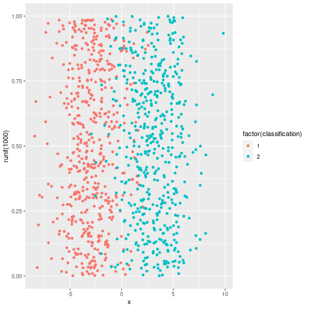
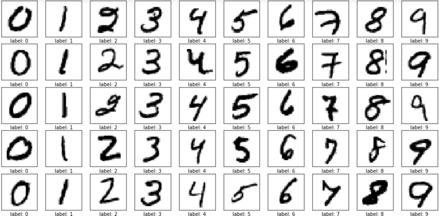
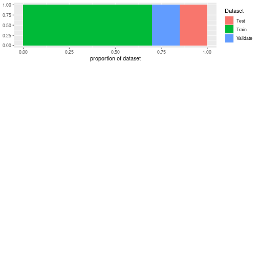
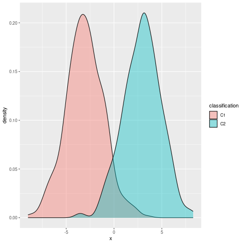
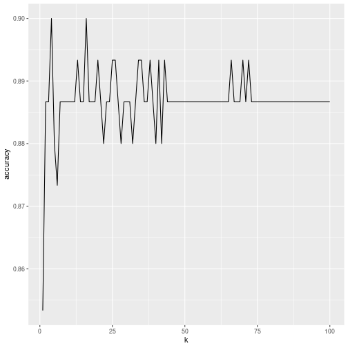
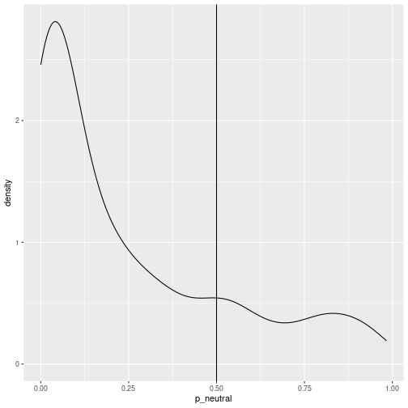
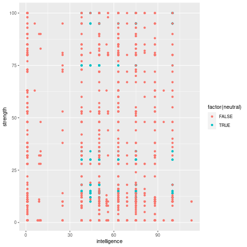
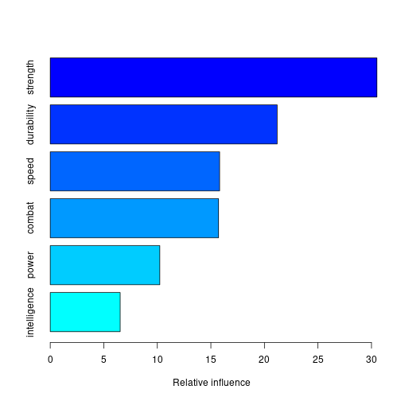
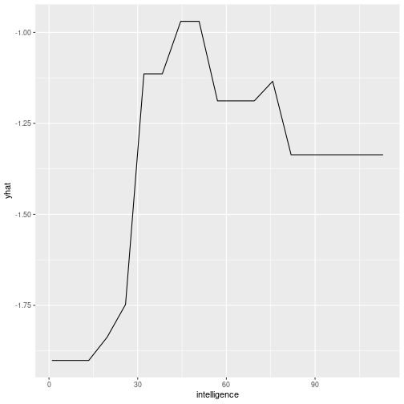

Classification
========================================================
author: Vincent Toups
date: 11 Sept 2020
width:1400
height:800
css:style.css




Clustering with some example data.

Clustering and Classification
========================================================

1. Closely related Machine Learning Techniques
2. Classification: assign new data to one of a known category 
   given by some labeled data.
3. Clustering: assign data to one of a set of clusters determined
   in some way from the data itself.
   
Classification is the easier problem by far. You want classification problems.
Clustering problems are a stygian pit.



With enough data, and assuming the labels are good, you can build a classifier
for anything.

Vocabulary
========================================================

0. Overfitting - a model which matches only its training data.
1. Training Data - build the model
2. Validation Data - tune the parameters
3. Testing Data - evaluate its "true" performance



Toy Data
========


```r
d <- tibble(x=c(rnorm(500,-3,2),
                rnorm(500,3,2)), 
            classification=factor(c(rep("C1",500),
                                    rep("C2",500))),
            set=factor(c(rep("Train",700),
                         rep("Validate",150),
                         rep("Test",150))
                       %>%
                       sample(1000,replace=FALSE))) %>%
    mutate(id=seq(1000));
d
```

```
# A tibble: 1,000 x 4
        x classification set         id
    <dbl> <fct>          <fct>    <int>
 1 -2.31  C1             Validate     1
 2 -0.116 C1             Train        2
 3 -7.15  C1             Train        3
 4 -0.268 C1             Test         4
 5 -8.97  C1             Test         5
 6 -1.22  C1             Train        6
 7 -1.47  C1             Validate     7
 8 -4.23  C1             Train        8
 9 -3.24  C1             Train        9
10 -3.24  C1             Test        10
# … with 990 more rows
```

Toy Data
========



Simplest Possible Classification
================================

K-Nearest Neighbor.

Find the K-nearest neighbors in the training data. Each such neighbor
votes for whatever its class is. Normalizing these votes produces a
"probability" for each classification - the largest is the best guess.

Code
====


```r
library(class);
train <- d %>% filter(set=="Train");
validate <- d %>% filter(set=="Validate");
test <- d %>% filter(set=="Test");

tr <- matrix(train$x, nrow=nrow(train));
tt <- matrix(validate$x, nrow=nrow(validate));

results <- do.call(rbind, Map(function(n){
    predictions <- knn(train = tr,
                       test = tt,
                       cl = train$classification,
                       k = n);
    acc <- sum(predictions == validate$classification)/length(predictions);
    tibble(k=n,acc=acc);   
}, seq(1,100))) %>% arrange(desc(acc),k);
```

Results
=======



Best?
=====

In higher dimensions finding N neighbors can be tricky if done naively so we
may prefer the model with the smallest number of neighbors (within reason).


```r
results %>% arrange(desc(acc),k) %>% head(3);
```

```
# A tibble: 3 x 2
      k   acc
  <int> <dbl>
1     4 0.9  
2    16 0.9  
3    13 0.893
```

Test Set Accuracy
=================


```r
pred <- knn(train = tr,
            test = matrix(test$x, nrow=nrow(test)),
            cl = train$classification,
            k = 17);
sum(pred==test$classification)/nrow(test);
```

```
[1] 0.9533333
```

Class Imbalance
===============

I've seen PhD Statisticians mess this up.

What if your training data isn't balanced?

Is it a sampling error or does it reflect a true fact about the prior
distribution of results?

In some situations this isn't particularly well defined. For instance,
you are training a classifier to distinguish between cats and
dogs. What is the prior probability of a picture being of a cat?

Accuracy Lies
=============

Consider:


```r
source("utils.R");

d <- read_csv("./source_data/datasets_38396_60978_charcters_stats.csv") %>%
    tidy_up_names() %>%
    mutate(neutral=alignment == "neutral") %>%
    drop_na();

means <- d %>% group_by(neutral) %>% summarize(p=length(intelligence)/nrow(d),
        int=mean(intelligence),
        str=mean(strength),
        spd=mean(speed),
        dur=mean(durability),
        pwr=mean(power),
        cbt=mean(combat)); means;
```

```
# A tibble: 2 x 8
  neutral      p   int   str   spd   dur   pwr   cbt
  <lgl>    <dbl> <dbl> <dbl> <dbl> <dbl> <dbl> <dbl>
1 FALSE   0.982   44.2  28.8  27.0  41.2  39.9  42.8
2 TRUE    0.0181  60.9  45.7  46.7  75.5  58.8  67.6
```

Simple Models Do Well On Unbalanced Data
========================================


```
# A tibble: 2 x 8
  neutral      p   int   str   spd   dur   pwr   cbt
  <lgl>    <dbl> <dbl> <dbl> <dbl> <dbl> <dbl> <dbl>
1 FALSE   0.982   44.2  28.8  27.0  41.2  39.9  42.8
2 TRUE    0.0181  60.9  45.7  46.7  75.5  58.8  67.6
```
1. 98% of all characters are not neutral.
2. So a model which always guesses "not neutral" has an accuracy of
   98%.
3. It is always wrong for non-neutral characters.
4. We need better metrics.

But Also Consider
=================

1. True Positive Rate  (tp): how often we predict a neutral correctly. (0 naive)
2. True Negative Rate  (tn): how often we predict a non-neutral correctly (1 naive)
3. False Positive Rate (fp): how often do we predict a non-neutral as neutral. (0 naive)
4. False Negative Rate (fn): how often do we predict neutral as non-neutral (1 naive)

Since these measures are over individual classes we can use them to
concoct summary results which are better at characterizing our system.

F1 Score
========


F1 is the harmonic mean of precision and recall.

F1 Score
========


```r
f1 <- MLmetrics::F1_Score;
f1
```

```
function (y_true, y_pred, positive = NULL) 
{
    Confusion_DF <- ConfusionDF(y_pred, y_true)
    if (is.null(positive) == TRUE) 
        positive <- as.character(Confusion_DF[1, 1])
    Precision <- Precision(y_true, y_pred, positive)
    Recall <- Recall(y_true, y_pred, positive)
    F1_Score <- 2 * (Precision * Recall)/(Precision + Recall)
    return(F1_Score)
}
<bytecode: 0x560ebaf02fa0>
<environment: namespace:MLmetrics>
```

Train Test Validate
===================

This is tricky - we need some data from each category but we don't
have a lot of neutral characters.

Lots of approaches here. One is that we subsample by category and
recombine the data.


```r
model_split <- function(dfi, train_p, validate_p, test_p, col_name="exp_group"){
    dfi <- sample_n(dfi, nrow(dfi),replace=FALSE);
    p <- (seq(nrow(dfi))-1)/nrow(dfi);
    train_dfi <- dfi %>% filter(p < train_p);
    validate_dfi <- dfi %>% filter(p < train_p + validate_p & p >= train_p);
    test_dfi <- dfi %>% filter(p >= train_p + validate_p);
    train_dfi[[col_name]] <- "train";
    validate_dfi[[col_name]] <- "validate";
    test_dfi[[col_name]] <- "test";
    rbind(train_dfi, validate_dfi, test_dfi);
}

## NOTE - I had to create a fake data set for illustrative purposes.
old_d <- d;
d <- read_csv("./source_data/faux-powers.csv");

d <- rbind(model_split(d %>% filter(neutral==TRUE), 1/3, 1/3, 1/3),
           model_split(d %>% filter(neutral==FALSE), 1/3, 1/3, 1/3));
d %>% group_by(neutral, exp_group) %>% tally()
```

```
# A tibble: 6 x 3
# Groups:   neutral [2]
  neutral exp_group     n
  <lgl>   <chr>     <int>
1 FALSE   test        500
2 FALSE   train       500
3 FALSE   validate    500
4 TRUE    test        166
5 TRUE    train       167
6 TRUE    validate    167
```

Generalized Linear Models for Logistic Regression
=================================================

KNN fails for somewhat obvious reasons on this data set. Let's break
out a GLM and do a logistic regression.


```r
train <- d %>% filter(exp_group=="train");
validate <- d %>% filter(exp_group=="validate");
test <- d %>% filter(exp_group=="test");
model <- glm(neutral ~ intelligence +
                 strength +
                 speed +
                 durability +
                 power +
                 combat,family=binomial(link='logit'),data=train)
pred <- predict(model, newdata=validate, type="response");
sum((pred>0.5) == validate$neutral)/nrow(validate);
```

```
[1] 0.82009
```

The F1 Score gives us a good idea of where we are:


```r
f1(validate$neutral, pred > 0.5);
```

```
[1] 0.8839458
```

Varying the Threshold
=====================

This can be a proxy for modifying the prior probability of the
condition.


```r
ggplot(tibble(p_neutral=pred),aes(p_neutral)) + geom_density() + geom_vline(xintercept=0.5);
```



The distribution of probabilities of a data point being "neutral". If
we lower our threshold for what counts as neutral presumably we'll
eventually start getting some right.

ROC Curve
=========

Plot True Positive Rate against False Postive Rate.


```r
roc <- do.call(rbind, Map(function(threshold){
    p <- pred > threshold;
    tp <- sum(p[validate$neutral])/sum(validate$neutral);
    fp <- sum(p[!validate$neutral])/sum(!validate$neutral);
    tibble(threshold=threshold,
           tp=tp,
           fp=fp)
},seq(100)/100))

ggplot(roc, aes(fp,tp)) + geom_line() + xlim(0,1) + ylim(0,1) +
    labs(title="ROC Curve",x="False Positive Rate",y="True Positive Rate");
```


The area under the curve is a good threshold-free estimate of the
performance of the classifier.

Choosing A Threshold
====================

We usually choose a threshold on the basis of some cost-benefit
analysis.

If the cost of a false positive is is negligible, then we want to
lower the theshold. Otherwise we need to find the threshold where the
cost associated with a false positive is balanced by the benefits of 
detecting the condition.

This requires a good estimate of the prior probability.

Eg - Pipes
==========

We have a model to predict when a pipe will break. It costs $200 to
repair a pipe after it breaks but only $20 to repair it
before. However, it costs $50 to send a crew to inspect a pipe.

expected_savings = 180*tp - 50*fp

We want this to be greater than zero

expected_savings = 180*tp - 50*fp >= 0

180*tp >= 50*fp

->

tp/fp >= 50/180 = 0.28

If we can't find a point on our ROC curve where tp/fp > 0.28 maybe our
classifier isn't worth it.

What About Our Test Dataset
===========================

The validation data set is used for model selection. In the case of a
GLM the model selection process involves things like dimensionality
reduction methods and parameter selection. We'll cover those in
another lecture.

Imagine looping over every combination of N parameters and using the
validation set to evaluate the results.

You might also have heard of LASSO and Ridge Regression. In that case
we might modify hyperparameters instead.

The summary function
====================

R has a method called `summary` that tells us interesting things about
our model.


```r
summary(model);
```

```

Call:
glm(formula = neutral ~ intelligence + strength + speed + durability + 
    power + combat, family = binomial(link = "logit"), data = train)

Deviance Residuals: 
     Min        1Q    Median        3Q       Max  
-2.27260  -0.51169  -0.22507   0.04431   2.70278  

Coefficients:
              Estimate Std. Error z value Pr(>|z|)    
(Intercept)  -8.050049   0.655501 -12.281  < 2e-16 ***
intelligence  0.022863   0.004759   4.804 1.56e-06 ***
strength      0.018278   0.003218   5.680 1.35e-08 ***
speed         0.030477   0.004555   6.691 2.22e-11 ***
durability    0.021826   0.003339   6.537 6.27e-11 ***
power         0.016971   0.003658   4.639 3.50e-06 ***
combat        0.030280   0.004409   6.867 6.54e-12 ***
---
Signif. codes:  0 '***' 0.001 '**' 0.01 '*' 0.05 '.' 0.1 ' ' 1

(Dispersion parameter for binomial family taken to be 1)

    Null deviance: 750.70  on 666  degrees of freedom
Residual deviance: 459.69  on 660  degrees of freedom
AIC: 473.69

Number of Fisher Scoring iterations: 6
```
Gradient Boosting Machines
==========================

Tree based learners are state of the art. If your space can be
partitioned in such a way as to separate your classes they will
probably find it.

Your biggest issue will be overfitting.


```r
ggplot(d, aes(intelligence, strength)) + geom_point(aes(color=factor(neutral)));
```



Hand Waving
===========

Take a subset of your features and build a simple tree to match your
categories. 

See how it does on the training data. Pick out the worst performers
and duplicate them and then fit another estimator. Repeat until your
performance is good enough.

Usage
=====

You want the "gbm" package.

Usage is more or less like the glm package.


```r
library(gbm)
model <- gbm(neutral ~ intelligence +
                 strength +
                 speed +
                 durability +
                 power +
                 combat, distribution="bernoulli",
             data=train,
             n.trees = 100,
             interaction.depth = 2,
             shrinkage = 0.1);

pred <- predict(model, validate, type="response");
sum((pred>0.5)==validate$neutral)/nrow(validate);
```

```
[1] 0.9475262
```

Great!

And the F1 score:


```r
f1(validate$neutral, pred > 0.5);
```

```
[1] 0.9651741
```

Summary on GBM Models
=====================


```r
summary(model);
```



```
                      var   rel.inf
strength         strength 30.507945
durability     durability 21.193447
speed               speed 15.818171
combat             combat 15.718406
power               power 10.231659
intelligence intelligence  6.530371
```

Why You Might Want a Logistic Regression
========================================

Logistical regressions are easy to fit and statistically sensible. You
know what you are getting.

They are also portable:


You can write this up in SQL if you have to. Moving a tree around is
harder.

They also don't overfit as easily because they have a limited number
of degrees of freedom to tune. It can be useful to use GBMs for
exploration and as an aid to understand the data, but to rely on a
logistical regression in practice. 

GBM's for Descriptive Purposes
==============================

Partial dependency plots.

```r
library(pdp);
pdp_data <- partial(model, "intelligence", n.trees=100);
ggplot(pdp_data, aes(intelligence,yhat)) + geom_line();
```



Intepretation - as intelligence gets larger, so does the chance that
our model classifies the input as being neutral. Handy!

Recap
=====

1. Classification is the business of training a model to divide new
   data into a set of categories.
2. Beware of large class imbalances. Use the correct score (usually
   F1) in highly imbalanced cases. But also consider a concrete
   cost benefit analysis.
3. ROC curves give a good sense of how well a classifier works even in
   the case of class imbalances.
4. R makes it easy to fit linear models (logistic regressions) and
   these can be translated into other contexts easily. 
5. Gradient Boosting Machines are powerful tree based methods for both
   classification and regression. They pretty much obviate the need
   for parameter selection but are difficult to interpret.   
6. Always split your data into training, validation and testing
   sets. Validation should be used for model and hyperparameter
   selection but always test the results on the final held out test
   set.
   
Reading Material
================

[Logistic Regression](https://en.wikipedia.org/wiki/Logistic_regression)
[ROC Curves](https://en.wikipedia.org/wiki/Receiver_operating_characteristic)
[F1 Score](https://en.wikipedia.org/wiki/F1_score)
[Gradient Boosting Machines](https://en.wikipedia.org/wiki/Gradient_boosting)
[R GBM Package](https://cran.r-project.org/web/packages/gbm/index.html)
[R pdp Package](https://www.rdocumentation.org/packages/pdp/versions/0.7.0)


