Dimensionality Reduction & Clustering
========================================================
author: Vincent Toups
date: 11 Sept 2020
width:1400
height:800
css:style.css


By Chire - Own work, CC BY-SA 4.0, https://commons.wikimedia.org/w/index.php?curid=59409335

Dimensionality Reduction
========================

Why?

1. Dumb monkey brain not understand [big dimensions](https://builtin.com/data-science/curse-dimensionality).
2. Computers are slow and many algorithms don't scale well with dimension.
3. Throw away variability which is not useful.
4. Deeper philosophical reasons: by measuring we project some
   presumably cogent physical process onto a manifold. Because
   measurement introduces external factors we presume that our 
   embedding may have more degrees of freedom than we actually need.
   
Example
=======

2D Pendulum with 3d noise.

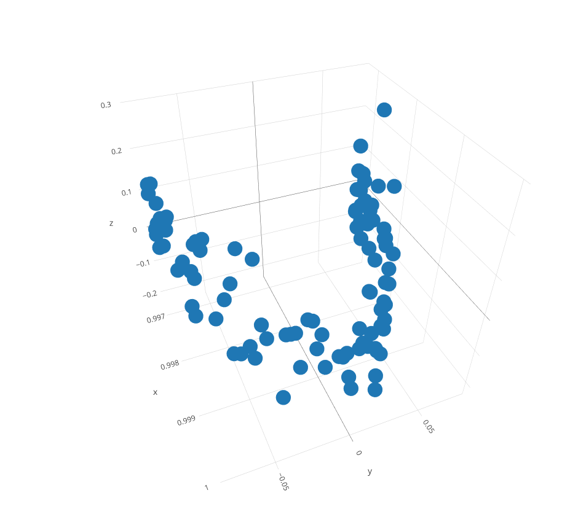

The pendulum has at any moment a definite position in space but our
measurement has independent errors in all three dimensions. We don't
care about the measurement error in the z direction, though.

PCA - The Idea
==============

Find a linear transformation of the data which aligns the axes with
progressively smaller directions of variation.


That is
=======


```r
pcs <- prcomp(example);
summary(pcs);
```

```
Importance of components:
                           PC1     PC2
Standard deviation     10.2545 2.97988
Proportion of Variance  0.9221 0.07787
Cumulative Proportion   0.9221 1.00000
```

Plotting
========


```r
xs <- pcs$rotation %>% t() %>% as_tibble() %>% `[[`("x");
ys <- pcs$rotation %>% t() %>% as_tibble() %>% `[[`("y");

ggplot(example, aes(x,y)) + geom_point() +
    geom_segment(data=tibble(x=c(0,0),y=c(0,0),xend=xs*pcs$sdev,yend=ys*pcs$sdev),
                 aes(x=x,y=y,xend=xend,yend=yend),size=4,color="red",arrow=arrow());
```

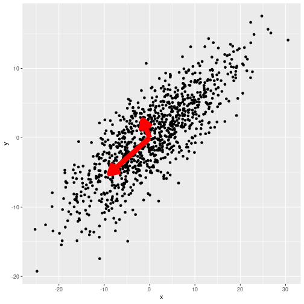

Rotating Our Data
=================

Lots of incomprehensible ways to do this in R.


```r
transformed <- do.call(rbind, Map(function(row){
    v <- solve(pcs$rotation) %*% c(example$x[row], example$y[row]);
    tibble(x=v[1],y=v[2]);    
}, seq(nrow(example))))

ggplot(transformed,aes(x,y)) + geom_point() +
    xlim(-30,30) +
    ylim(-30,30);
```


"Projecting" Our Data
=====================


```r
ggplot(transformed, aes(x)) + geom_density();
```


PCA on Our Oscillator
=====================


```r
library(tidyverse);
data <- read_csv("source_data/pendulum.csv");
pcs <- prcomp(data %>% select(x,y,z));
summary(pcs);
```

```
Importance of components:
                           PC1      PC2       PC3
Standard deviation     0.05653 0.001527 0.0009949
Proportion of Variance 0.99896 0.000730 0.0003100
Cumulative Proportion  0.99896 0.999690 1.0000000
```
And transforming our data:

```r
transformed <- do.call(rbind, Map(function(row){
    v <- solve(pcs$rotation) %*% c(data$x[row], data$y[row], data$z[row]);
    tibble(x=v[1],y=v[2],z=v[3]);    
}, seq(nrow(data))))
p<-ggplot(transformed,aes(x,y)) + geom_point(); p;
```

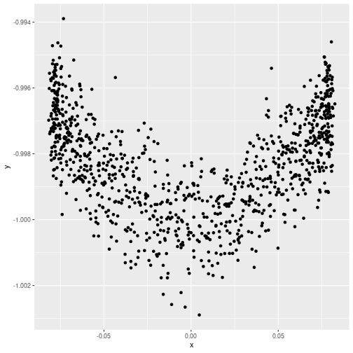

PCA on Our Oscillator
=====================


This is a trivial example wherein we know by definition that we can
ignore our z coordinate. But in general when we apply PCA we don't
know all that much about how our high dimensional data looks.

PCA is Linear
=============

Its a rotation!

It won't work on this:

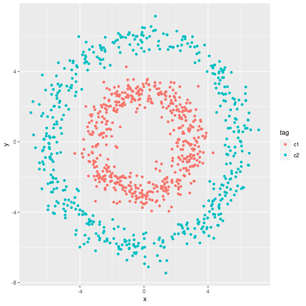

Two clusters here but the two PCs are identical and indeed degenerate!

There are some methods that might work here, but we won't cover
them. Know your data.

Other Nonlinear Methods
=======================

Six dimensional data with 5 gausian (axis aligned because I'm lazy)
clusters.

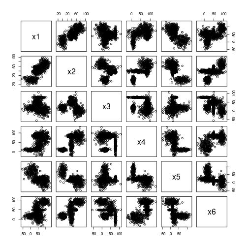

First Two PCAs
==============


```r
pcs <- prcomp(data %>% select(-label));
transformed <- do.call(rbind, Map(function(row){
    v <- solve(pcs$rotation) %*% c(data$x1[row],
                                   data$x2[row],
                                   data$x3[row],
                                   data$x4[row],
                                   data$x5[row],
                                   data$x6[row]);
    tibble(label=data$label[row],
           c1=v[1],
           c2=v[2],
           c3=v[3],
           c4=v[4],
           c5=v[5],
           c6=v[6]);    
},
seq(nrow(data))))

ggplot(transformed, aes(c1,c2))+ geom_point(aes(color=label));
```

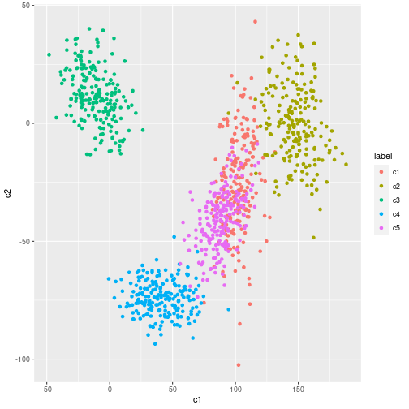

Multidimensional Scaling
========================

A (family) of procedures based on minimizing a loss function. Think of
it as trying to reproduce the high dimensional distance matrix using a
lower number of dimensions.

Classical:


```r
d <- dist(data %>% select(-label));
fit <- cmdscale(d, eig=TRUE, k=2);
ggplot(fit$points %>%
       as.data.frame() %>%
       as_tibble() %>%
       mutate(label=data$label), aes(V1,V2)) + geom_point(aes(color=label));
```

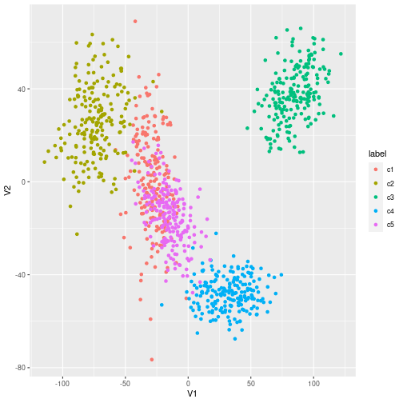

NonMetric Multidimensional Scaling
==================================


```r
library(tidyverse);
d <- dist(data %>% select(-label));
fit2 <- MASS::isoMDS(d, k=2);
```

```
initial  value 11.765807 
final  value 11.765298 
converged
```

```r
ggplot(fit2$points %>%
       as.data.frame() %>%
       as_tibble() %>%
       mutate(label=data$label), aes(V1,V2)) + geom_point(aes(color=label));
```


TSNE
====

Tries to match the probability distribution of the true distances to
the one produced by the lower dimensional data set.

Can produce very suggestive results but they may not always reflect
true clusterings.


```r
library(Rtsne);
fit <- Rtsne(data %>% select(-label),dims =2);
ggplot(fit$Y %>% as.data.frame() %>% as_tibble() %>% mutate(label=data$label), aes(V1,V2)) +
    geom_point(aes(color=label));
```

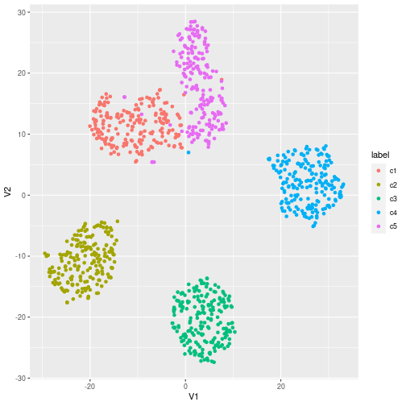

Auto-Encoders
=============

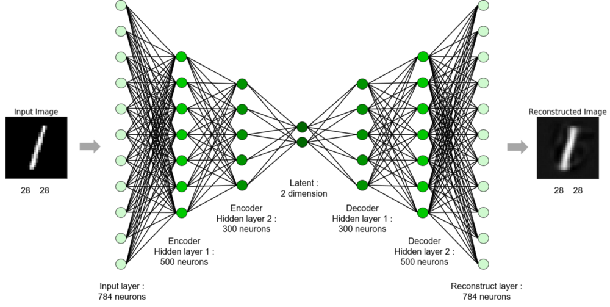;

We ask a neural network to learn to encode our data into a lower
dimensional representation and then to reconstruct the input from that
representation.

Example
======

See the file keras-example.R, which produces this projection.

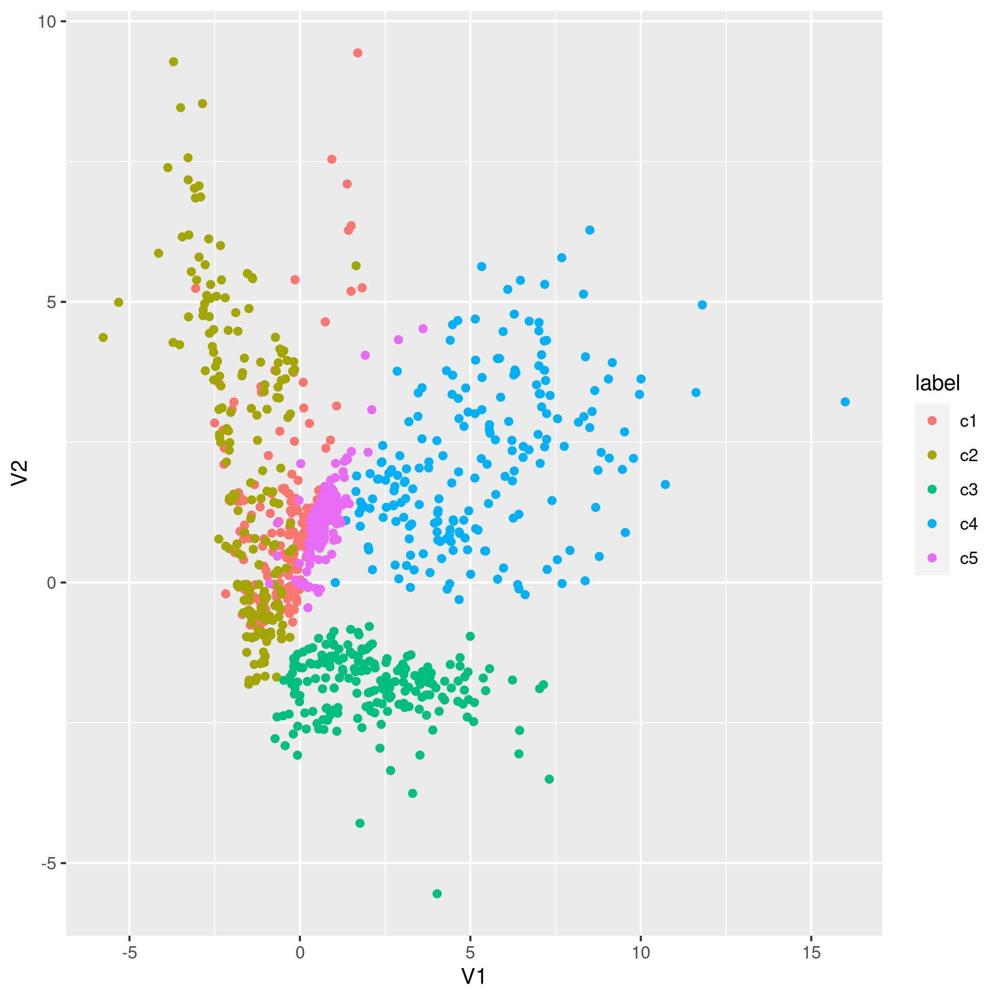

On Neural Nets
==============

1. This approach is very flexible - because you control the entire
network you can enforce a variety of different encoding strategies at
different layers.

2. The encoder can be used on new data (unlike TSNE or other nonlinear
   methods).

3. Unfortunately, building a network and training it is very
   complicated. Knowing what the network is doing is also hard.

Some Notes
==========

1. Of the above, only PCA and Auto Encoders easily handle new data.
2. PCA is the most comprehensible in terms of its
   interpretation. Non-linear dimensionality reduction methods like TSNE
   and MDS may introduce structure in your data that isn't real.
3. Generally, as it pertains to clustering and classification,
   dimensionality reduction methods apart from PCA are useful for
   examining the data and the results, not as pre-processing steps.
   
Clustering
==========

Taking a set of data and separating it into clusters based on
structure in the data. 

No prior labels.


By Chire - Own work, CC BY-SA 4.0, https://commons.wikimedia.org/w/index.php?curid=59409335

Clustering
==========

1. Clustering is purely an exploratory process
2. There is no "correct clustering"
3. Thus choosing things like the number of clusters cannot be resolved
   by a formal procedure.
   
K-Means
=======

K-Means is neat because I can explain it to you in 2 minutes and you
can all implement it.


By Chire - Own work, CC BY-SA 4.0, https://commons.wikimedia.org/w/index.php?curid=59409335

K-Means
=======

Given a number of clusters N:

1. Assign each point to a cluster 1..N randomly.
2. Calculate the cluster centers of mass C_i.
3. Re-assign each point to the center of mass to which it is closest.
4. compare the new centers of mass to the old centers of mass
   if they haven't changed much, go back to 2.
   otherwise you're done.
   
K-Means
=======

K Means gives you assignments for each cluster as well as the N
cluster centers. Thus, if you get a new data point it is easy to know
which cluster it belongs to: the closest center of mass cluster.

K-Means optimizes the sum of squared distances to the closest cluster
center.

Thus, the best number of clusters is K = N (N being the number of data
points).

K-Means in R
============


```r
library(tidyverse);
library(Rtsne);
source("utils.R");
heroes <- read_csv("./source_data/datasets_38396_60978_charcters_stats.csv") %>%
    tidy_up_names() %>%
    select(intelligence, strength, speed, durability, power, combat, total) %>%
    filter(total > 20) %>%
    select(-total) %>% distinct();

cc <- kmeans(heroes, 4);
fit <- Rtsne(heroes, dims = 2);
ggplot(fit$Y %>% as.data.frame() %>% as_tibble() %>% mutate(label=cc$cluster),aes(V1,V2)) +
    geom_point(aes(color=factor(label)));
```

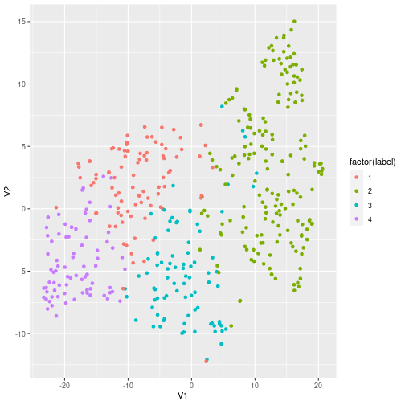

What to Do With This
====================

Look at cluster centers:


```r
cc$centers
```

```
  intelligence strength    speed durability    power   combat
1     58.17778 69.81111 36.32222   74.46667 48.98889 67.48889
2     58.56111 14.47778 24.53889   29.45000 41.21667 56.31667
3     60.30952 23.14286 45.10714   72.64286 66.67857 52.33333
4     76.70513 85.50000 63.23077   91.71795 90.58974 69.80769
```

Or the total sum of squares distances over all clusters.


```r
cc$tot.withinss
```

```
[1] 881493.4
```

Choosing the Number of Clusters
===============================

There is no true answer here.  However, standard practices are useful
for communication and also to make our live easier.

The `cluster` package allows us to calculate the GAP statistic.

Mind the Gap
============

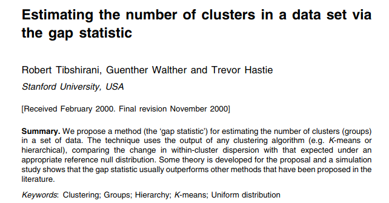

Mind the Gap
============


Example In R
============


```r
library(cluster);
results <- clusGap(read_csv("source_data/six-dimensions.csv") %>%
                 select(x1,x2,x3,x4,x5,x6),
                 kmeans,
                 K.max = 10,
                 B = 500);
ggplot(results$Tab %>% as_tibble() %>%
       mutate(k=seq(nrow(.))), aes(k,gap)) + geom_line();
```

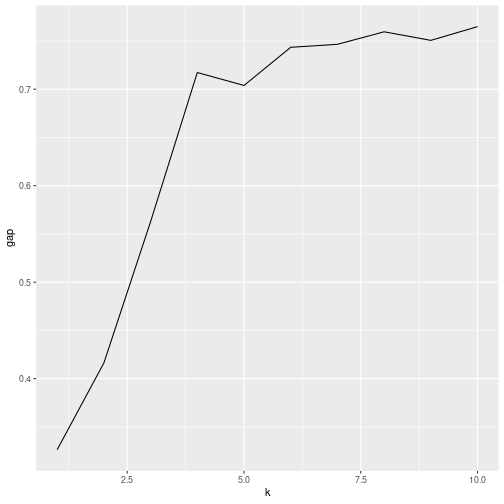
Sadly, this is pretty typical!

I pick the knee rather than the peak. But who knows.

K-Means is Based on Centroids
=============================

Clusters can be concentric.

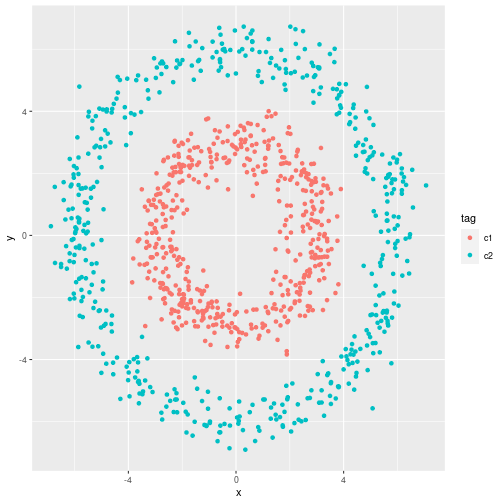

Recall this is precisely the sort of thing which also confuses PCA.
Thus, clustering higher dimensional data is quite challenging.

Hierarchical Clustering
=======================

Start with as many clusters as data points. Merge clusters by some
criteria in successive steps (eg, merge the two "closest" clusters)
until you have just one cluster or some other stopping criteria is
met.

In R
====


```r
data <- read_csv("./source_data/six-dimensions.csv");
distances <- dist(data);
results <- hclust(distances, method="average");
plot(results);
```


Selecting a Number of Clusters
==============================


```r
at_6 <- cutree(results, k=6);
fit <- Rtsne(data, dims = 2);
ggplot(fit$Y %>% as.data.frame() %>% as_tibble() %>% mutate(label=at_6),aes(V1,V2)) +
    geom_point(aes(color=factor(label)));
```

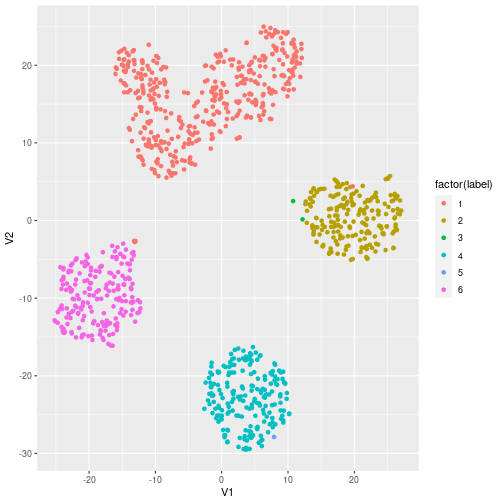

This isn't quite what we might have expected but we might tune things
by selecting an approprite linkage.

Spectral Clustering
===================

Intuitively: clusters are more appropriate defined by whether a point
is "connected" to some other point by nearby points or not.

1. Create a connectivity matrix (say by thresholding the distance
   matrix).
2. Find the so-called Graph Laplacian, which is an operator which
   represents one step of a random walk on the graph.
3. The eigenvectors of this Laplacian represent a sort of embedding of
   our data set in this "connectivity space".
4. Truncate them and do a k-means or other clustering.

In R
====


```r
library(kernlab);
library(tidyverse);

d <- rbind(tibble(theta=runif(500)*2*pi,r=rnorm(500,3,0.5),tag="c1"),
           tibble(theta=runif(500)*2*pi,r=rnorm(500,6,0.5),tag="c2")) %>%
    mutate(x=r*cos(theta),y=r*sin(theta));
distances <- dist(d %>% select(x,y) %>% as.matrix()) %>% as.matrix();
labels <- specc(distances, 2) %>% as.vector();
ggplot(d %>% mutate(label=labels), aes(x,y)) + geom_point(aes(color=factor(label)));
```

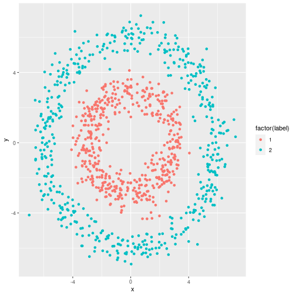

NB - Spectral clustering gives centroids but they may not be useful!

Recap 1
=======

1. Dimensionality Reduction encompasses methods to visualize and
   pre-treat our data sets.
2. PCA is just a rotation in N dimensions aligning axes with
   directions of decreasing variation.
3. Because errors are sometimes small and uncorrelated with our
   interests we can sometimes remove them by throwing away variation
   along PCs with small variance.
4. For visualization try non-linear methods. TSNE is probably the
   strongest algorithm (too strong).
5. Be aware of which methods allow you to use new data.
6. You can do dimensionality reduction with neural networks called
   auto-encoders.

Recap 2
=======

1. Clustering is a stygian pit!
2. K-means is easy to understand and gives cluster centers.
3. Hierarchical clustering is somewhat easy to understand
4. There are many methods to choose a number of clusters. We looked at
   the Gap Statistic.
5. Use dimensionality reduction to evaluate clustering
   results. Typically, we don't do reduction before clustering except
   perhaps PCA.
